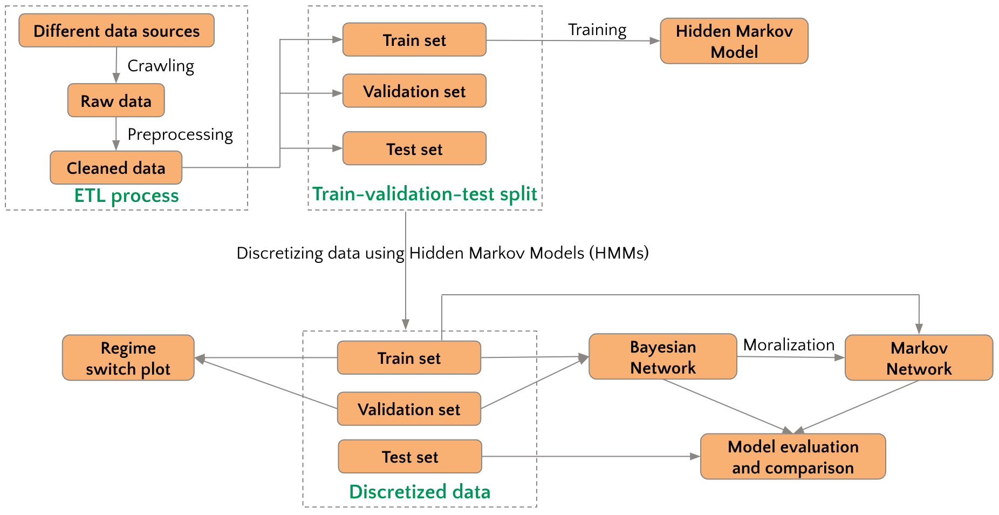

# WQU Capstone project: BTC price prediction with PGM for swing trading

## 1. Motivation

The objective of this project is to develop a predictive model for Bitcoin (BTC) price using a Probabilistic Graphical Model (PGM). By leveraging the power of PGMs, we aim to identify the key sentiment, financial, technical, and on-chain factors that significantly influence the price of BTC. This analysis will provide valuable insights for swing traders looking to make informed trading decisions.

The project encompasses the following goals:

- **Factor Identification**: We will carefully analyze a diverse set of sentiment, financial, technical, and on-chain metrics to identify the most influential factors affecting the price of BTC. To understand these factors, we can gain deeper insights into the market dynamics.
- **PGM Construction**: Using the identified factors, we will construct a sophisticated Probabilistic Graphical Model. This model will capture the complex relationships and dependencies among the factors, allowing us to predict accurately future BTC price movements.
- **Performance Comparison**: To demonstrate the effectiveness of our PGM-based approach, we will compare its performance against a mean-reverting strategy. By evaluating and contrasting the outcomes of both approaches, we aim to showcase the viability and potential advantages of our predictive model.

By achieving these objectives, we seek to provide traders and investors with a valuable tool for making informed decisions in the dynamic and volatile world of cryptocurrency trading.

## 2. Data

The dataset can be accessible in [./historical_data](./historical_data/), including:

- [Financial Data](./historical_data/financial_data.csv): This includes data from the S&P500, Gold, 13-Week Treasury, and the USD Index. We sourced our financial data from Yahoo Finance.
- [On-chain Data](./historical_data/btc_onchain_data.csv): We included various on-chain variables such as hash rate, block difficulty, and transaction count. To acquire this data, we utilized the Coin Metrics API v4.
- [Sẹntiment Data](./historical_data/google_trend.csv): To gauge the sentiment surrounding Bitcoin, we utilized Google Trends data, specifically focusing on the word count associated with Bitcoin. The data collection for this category was done using the Google Trends Python API.
- [Bitcoin Market Data](./historical_data/btc_ohlcv.csv): This category encompasses Bitcoin candle and volume data. These indicators provide valuable insights into different dimensions of price momentum, trend analysis, volatility, and volume dynamics.
- [Technical Indicators](./preprocessed_data/preprocessed_data.csv): We included a variety of technical indicators such as RSI, MACD, and Bollinger Bands. These indicators provide valuable insights into different dimensions of price momentum, trend analysis, volatility, and volume dynamics.

## 3. The workflow



## 4. Implementation

- Download and install `conda` at [here](https://www.anaconda.com/download).

- Create a virtual environment dedicated to this project by running the following commands:

```bash
conda create -n wqu python=3.9
conda activate wqu
```

- Clone this repository:

```bash
git clone https://github.com/honghanhh/wqu_capstone_project_3621.git
cd wqu_capstone_project_3621
```

- Run the following command to install the required packages:

```bash
pip install -r requirements.txt
```

- Run the following command to compile end-to-end pipeline:

```python
cd source_code
chmod +x run.sh
./run.sh
```

If you want to run each step of the pipeline separately, run each of the command in the `run.sh` file.

## Contributors

- 🐮 [Hanh Tran](https://github.com/honghanhh) 🐮
- [Moaz Razi ](https://github.com/moazrazi)
- [Phat Nguyen](https://github.com/fattiekakes)
